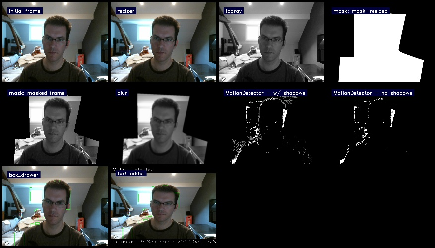
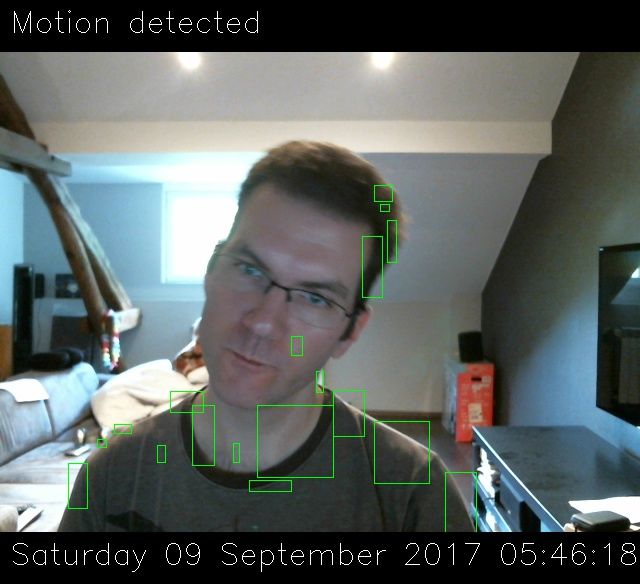

raspicam
========

Playground for Raspberry Pi motion detection using Python.

    Output picture in debug mode, showing all pipeline steps.

    Output picture in normal mode, showing the final pipeline output.

Some assumptions
----------------

The ``bootstrap.bash`` script assumes a clean installation of the Raspian
image, but it should work on existing systems as well. Nothing will be deleted.
It will only install dependencies and compile the latest version of OpenCV.

Another assumption is that this will be run on a Raspberry Pi. It is unlikely
that such a device has many processes running, which reduces the need for a
virtual environment. Hence, all dependencies are installed system-wide. It *is*
possible to compile OpenCV for Python virtual environments, but it requires a
bit more manual fiddling around. Which is why I decided to skip the use of a
virtual environment.

How to setup
------------

.. note::

    This project has been tested on:
    
    * `Raspbian Jessie Lite <https://downloads.raspberrypi.org/raspbian_lite/images/raspbian_lite-2017-07-05/>`_.
    * `Raspbian Stretch Lite <https://downloads.raspberrypi.org/raspbian_lite/images/raspbian_lite-2017-08-17/>`_.
    
    For other systems you may need to fix the "bootstrap" script.

1. Download the raspian image from the link above
2. Write the image to the SD-card of the Raspberry Pi
3. Boot the Raspberry Pi and update the packages::

        sudo aptitude update
        sudo aptitude upgrade

4. Clone the project into your home folder::

        sudo aptitude install git
        git clone https://github.com/exhuma/raspicam

5. Run the bootstrap script:

   .. note::

        This step will easily take over an hour to finish but *should* be
        automated! I **highly** recommend installing ``tmux`` first and run
        this step inside a tmux session in case you lose network connection.

   ::

       cd raspicam
       sudo bash bootstrap.bash

6. Run the application::

        cd ~/raspicam
        python3 project/main.py --help
        python3 project/main.py -vvv -w  # with simple WebUI
